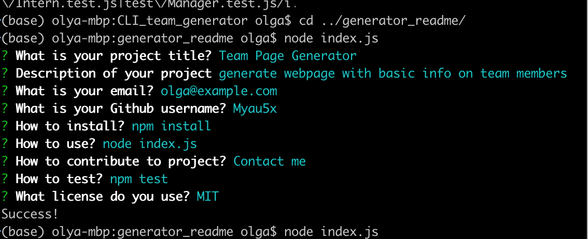

# Generator readme 
  CLI app that generate good readme
  # Table of Contents
  1. [Installation](#installation)
  2. [Usage](#usage)
  3. [License](#license)
  4. [Detailed description](#detailed-description)
  4. [Files](#files)
  6. [Questions](#questions)
## Installation
To install please use: 
`npm install`
## Usage
To use do next: 
`node index.js`
## License
[License: MIT](./LICENSE)
## Detailed description
A command-line application that accepts user input and generate README file for user project.
Generated file contains Title, Description, License badge and such section as  Installation, Usage, Contributing, Tests and Question.

[Video how it work](https://drive.google.com/file/d/1uADNvRAKNJy6OkjjrNceiWElCCTt6sMt/view?usp=sharing)

For promts I used `inquirer` node packages
## Files
 - `index.js` main file that ask user information
 - `utils/generateMarkdown.js` module that generate markdown file
 - `package.json` files with node dependencies
 - `example.md` example of generated readme file

## Questions
For questionts please contact [me](https://github.com/Myau5x) at ola.illari@gmail.com
 

